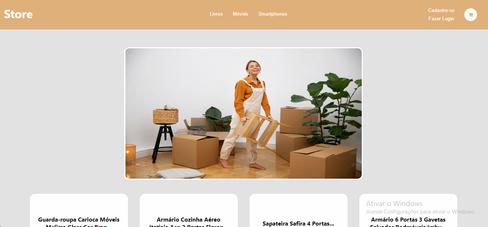

<h1>
    <p align="center">
    
        </p>
    <p>E-commerce project for studying 👨‍💻</p>
</h1>

## 🧑‍💻 Preview

<p align="center">
    
</p>

## 📖 About

This project is aimed at the development of an e-commerce that features retail in general, such as books, furniture and smartphones. The project itself is intended to be **used for study, development and deepening** in the **React framework, JavaScrpit and TypeScript languages**, as well as **libraries such as Context Api and Redux**, and other technologies.

The API is consumed at: https://api.mercadolibre.com/sites/MLB

The initial basis for this project was taken from the Youtube channel devGust: https://www.youtube.com/watch?v=jVDopeb20FE&t=2646s

## 👷‍♂️ Installation Instructions

To install project dependencies, be sure to use the following command:

```bash
npm install --legacy-peer-deps

## 🔨 Tools

- [TypeScript](https://www.typescriptlang.org/docs/)
- [JavaScript](https://devdocs.io/javascript/)
- [React](https://react.dev/)
- [ContextAPI](https://legacy.reactjs.org/docs/context.html)
- [Yup](https://www.npmjs.com/package/yup)
- [Axios](https://axios-http.com/docs/intro)
- [Firebase](https://firebase.google.com/)
```
